# Warsha - Ecommerce Api

A comprehensive E-commerce platform built with Django REST Framework (DRF), featuring user authentication, product catalog, shopping cart, order management, and payment processing.

## 🚀 Features

### User Management
- Custom user model with email authentication
- JWT-based authentication with token refresh and blacklist
- Google OAuth2 login integration
- Password reset via OTP (email-based)
- User profiles with vendor capabilities
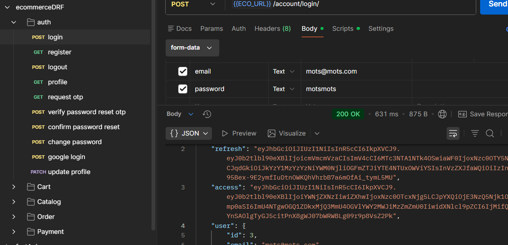

### Product Catalog
- Hierarchical category system
- Brand management (Multi-vendor (brands) linked to users)
- Product variants with pricing, stock, and specifications
- Product images with organized file storage
- Product reviews and ratings (Users can review only purchased products - Average rating calculated dynamically)
- Wishlist functionality (Add/remove products from wishlist and one wishlist per user)

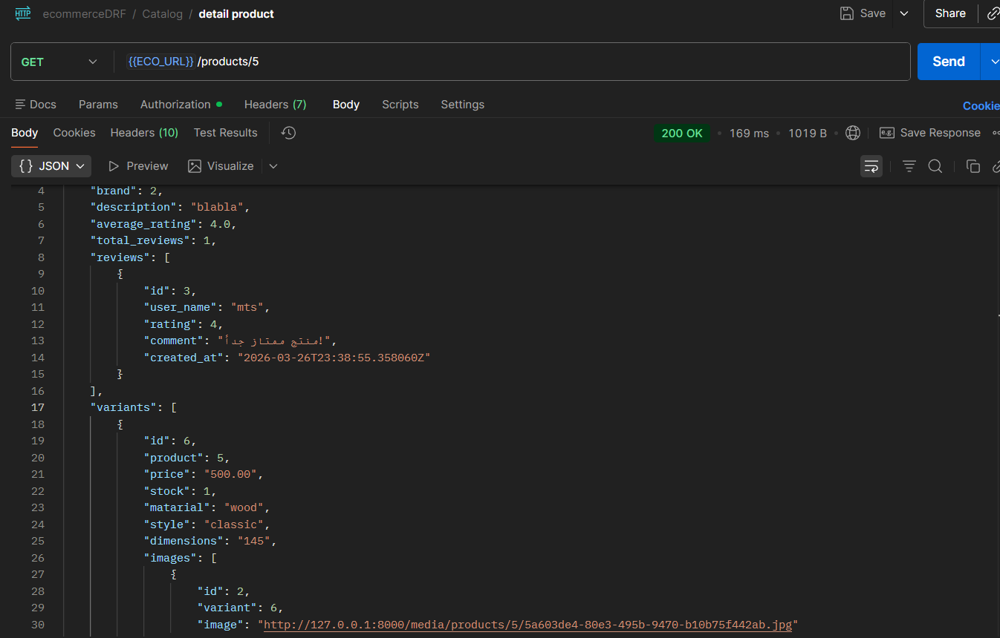

### Shopping Cart
- Persistent cart per user
- Cart items with quantity management
- Coupon system (percentage-based discounts)
- Brand-specific and global coupons
- Automatic price calculations with discounts

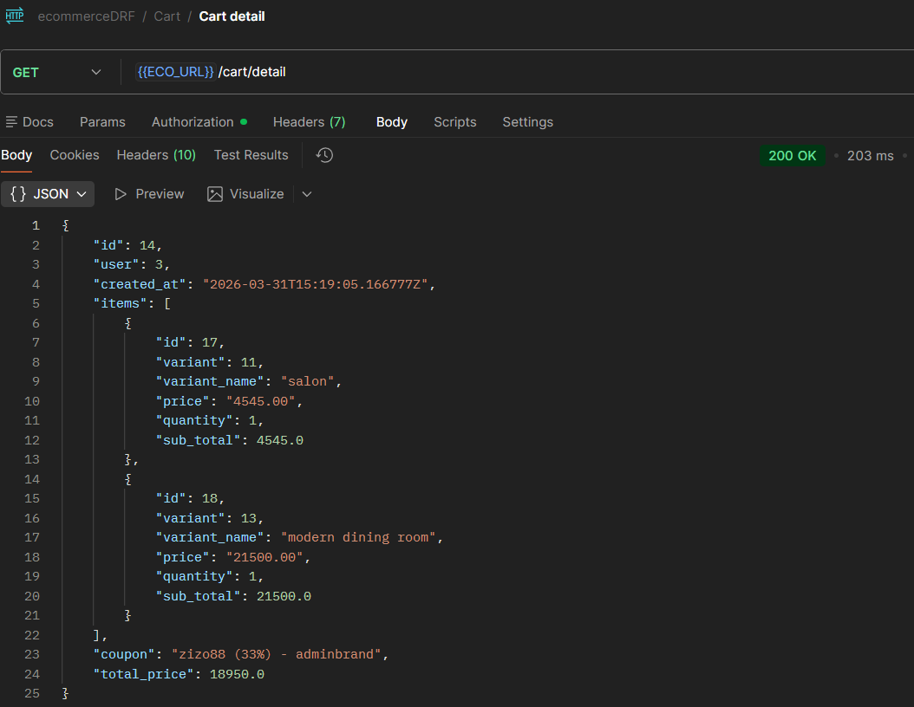

### Order Management
- Order creation from cart
- Order status tracking (Pending, Processing, Shipped, Delivered, Cancelled)
- Order history and details
- Shipping address and phone management

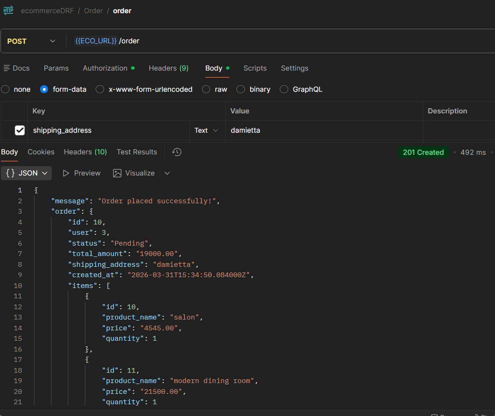

### Payment System
- Multiple payment methods (Credit Card, Cash on Delivery)
- Stripe Checkout Session integration
- Webhook handling for payment confirmation
- Async processing using Celery
- Payment status tracking and Automatic order status update after payment
- Email confirmation sent after successful payment

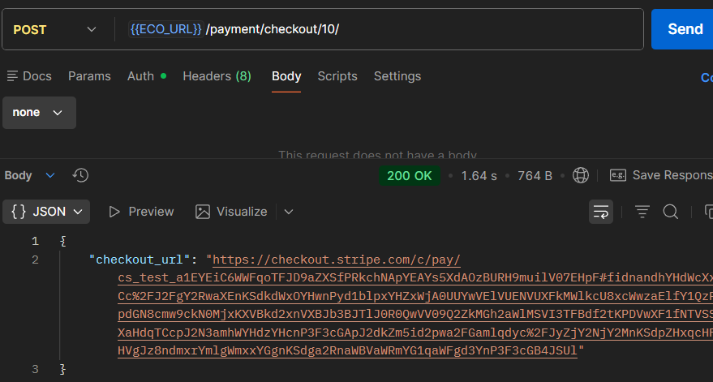

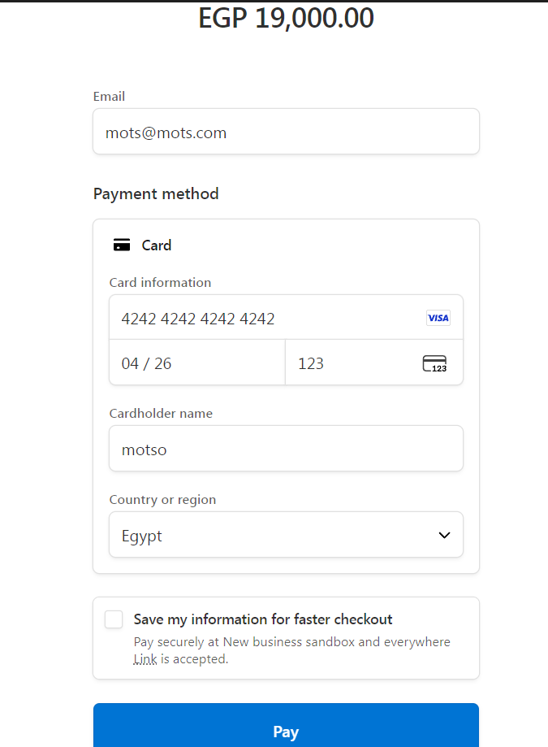

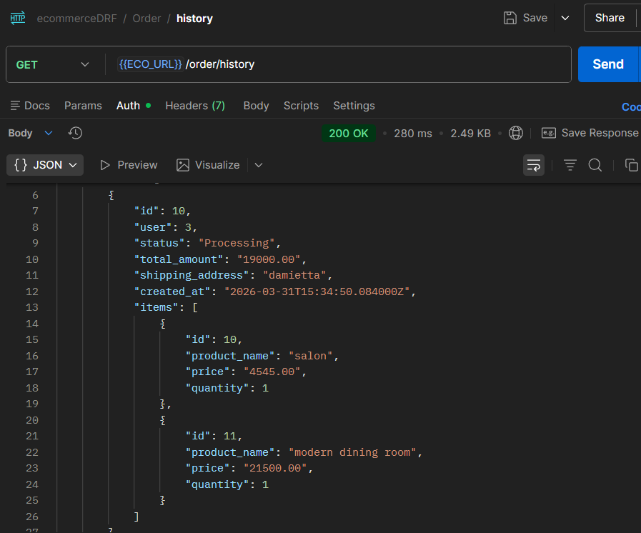

### Email System
- OTP email for password reset
- Order confirmation email after payment
- Background tasks handled using Celery + Redis as message broker

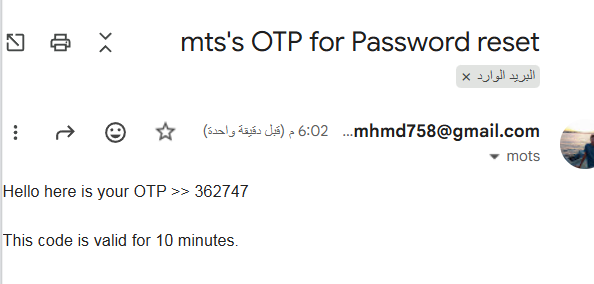

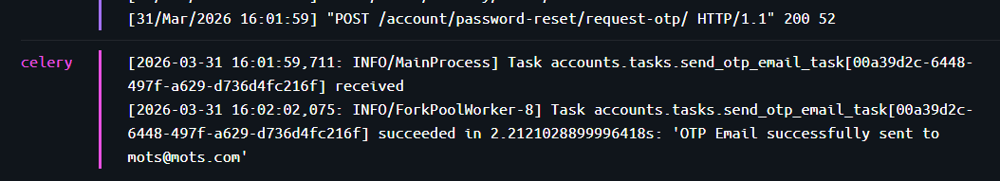

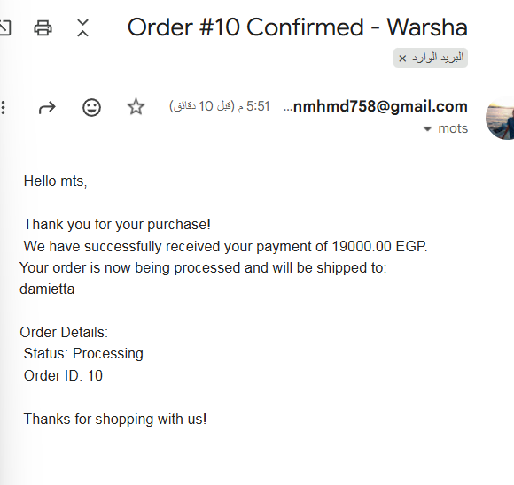

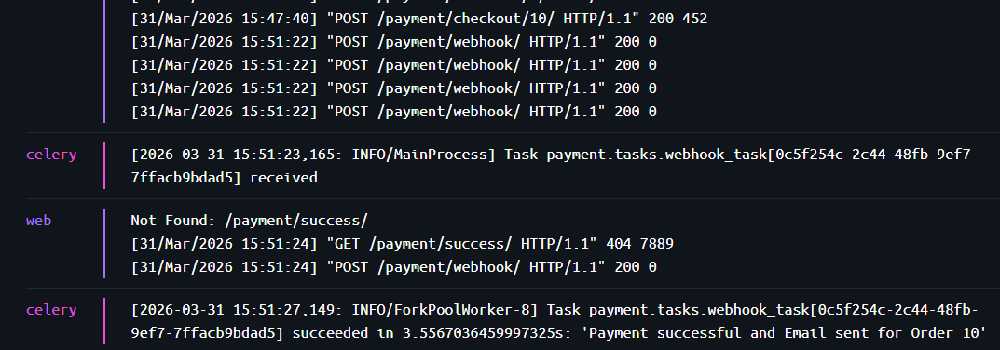

### Additional Features
- API documentation with Swagger UI
- Filtering, searching, and ordering across all endpoints
- Pagination for large datasets
- Docker containerization
- PostgreSQL database
- Media file handling

## 🛠️ Tech Stack

- **Backend**: Django 5.2, Django REST Framework
- **Database**: PostgreSQL, Django ORM
- **Authentication**: JWT (Simple JWT), Google OAuth2
- **Task Queue**: Celery with Redis
- **Documentation**: DRF Spectacular (Swagger/OpenAPI)
- **Containerization**: Docker & Docker Compose
- **Python Version**: 3.10

## 📋 Prerequisites

- Docker and Docker Compose
- Python 3.10 (if running without Docker)
- PostgreSQL (handled by Docker)

## 🚀 Installation & Setup

### Using Docker (Recommended)

1. **Clone the repository**
   ```bash
   git clone https://github.com/mopharaoh/warsha-ecommerceDRF
   cd drf_ecommerce
   ```

2. **Create environment file**
   ```bash
   cp .env.example .env
   ```
   Configure your environment variables in `.env`:
   ```
   DB_password=your_postgres_password
   GOOGLE_CLIENT_ID=your_google_client_id
   SECRET_KEY=your_django_secret_key
   ```

3. **Build and run with Docker Compose**
   ```bash
   docker-compose up --build
   ```

4. **Run migrations**
   ```bash
   docker-compose exec web python manage.py migrate
   ```

5. **Create superuser**
   ```bash
   docker-compose exec web python manage.py createsuperuser
   ```

### Manual Setup (Without Docker)

1. **Clone and setup virtual environment**
   ```bash
   git clone https://github.com/mopharaoh/warsha-ecommerceDRF
   cd drf_ecommerce
   python -m venv env
   source env/bin/activate  # On Windows: env\Scripts\activate
   ```

2. **Install dependencies**
   ```bash
   pip install -r requirments.txt
   ```

3. **Setup PostgreSQL database**
   - Create a PostgreSQL database named `ecommerceDB`
   - Update database credentials in `ecommerceDRF/settings.py`

4. **Run migrations**
   ```bash
   python manage.py makemigrations
   python manage.py migrate
   ```

5. **Start Redis server** (for Celery)
   ```bash
   redis-server
   ```

6. **Start Celery worker**
   ```bash
   celery -A ecommerceDRF worker -l info
   ```

7. **Run development server**
   ```bash
   python manage.py runserver
   ```

## 📖 API Documentation

Once the server is running, access the API documentation at:
- **Swagger UI**: `http://localhost:8000/api/docs/`

## 🔗 API Endpoints

### Authentication
- `POST /account/register/` - User registration
- `POST /account/login/` - User login
- `POST /account/google-login/` - Google OAuth login
- `POST /account/request-otp/` - Request password reset OTP
- `POST /account/verify-otp/` - Verify OTP and reset password
- `GET /account/profile/` - Get user profile
- `PUT /account/profile/` - Update user profile

### Catalog
- `GET /` - List products (with filtering/search)
- `GET /categories/` - List categories
- `GET /brands/` - List brands
- `POST /brands/` - Create brand (authenticated)
- `GET /<product_id>/` - Product details
- `POST /products/` - Create product (authenticated)
- `PUT /products/<id>/` - Update product (brand owner only)
- `POST /variants/` - Create product variant
- `PUT /variants/<id>/` - Update variant
- `POST /images/` - Upload product image
- `PUT /images/<id>/` - Update image

### Cart
- `GET /cart/` - Get user's cart
- `POST /cart/items/` - Add item to cart
- `PUT /cart/items/<id>/` - Update cart item
- `DELETE /cart/items/<id>/` - Remove cart item
- `POST /cart/apply-coupon/` - Apply coupon to cart

### Orders
- `GET /order/` - List user's orders
- `POST /order/` - Create order from cart
- `GET /order/<id>/` - Order details

### Payment
- `GET /payment/` - List user's payments
- `POST /payment/` - Process payment for order

## 🏗️ Project Structure

```
drf_ecommerce/
├── accounts/              # User management app
│   ├── models.py         # Custom user model, OTP
│   ├── views.py          # Auth views, profile
│   ├── serializers.py    # Auth serializers
│   └── urls.py           # Auth endpoints
├── catalog/              # Product catalog app
│   ├── models.py         # Product, Category, Brand models
│   ├── views.py          # Product CRUD views
│   ├── serializers.py    # Product serializers
│   └── urls.py           # Catalog endpoints
├── cart/                 # Shopping cart app
│   ├── models.py         # Cart, CartItem, Coupon models
│   ├── views.py          # Cart management views
│   └── urls.py           # Cart endpoints
├── Order/                # Order management app
│   ├── models.py         # Order, OrderItem models
│   ├── views.py          # Order views
│   └── urls.py           # Order endpoints
├── payment/              # Payment processing app
│   ├── models.py         # Payment model
│   ├── views.py          # Payment views
│   └── urls.py           # Payment endpoints
├── ecommerceDRF/         # Main Django project
│   ├── settings.py       # Django settings
│   ├── urls.py           # Main URL configuration
│   ├── celery.py         # Celery configuration
│   └── wsgi.py           # WSGI config
├── media/                # Uploaded media files
├── env/                  # Virtual environment (if not using Docker)
├── Dockerfile            # Docker image config
├── docker-compose.yml    # Docker services
├── manage.py             # Django management script
├── requirments.txt       # Python dependencies
└── README.md             # This file
```

## 🔧 Configuration

### Environment Variables
Create a `.env` file in the project root with:
```
DB_password=your_postgres_password
GOOGLE_CLIENT_ID=your_google_client_id
SECRET_KEY=your_django_secret_key
```

### Database Configuration
The project uses PostgreSQL. Database settings are configured in `ecommerceDRF/settings.py`.

### JWT Settings
JWT token lifetimes and settings are configured in `SIMPLE_JWT` in settings.py.

